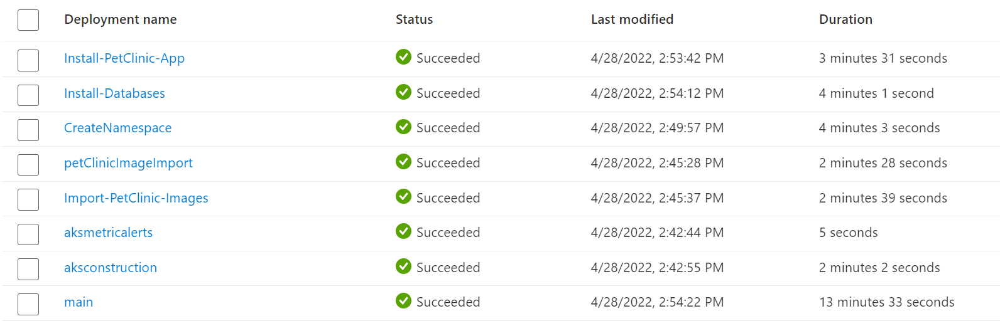

# AKS-Construction - Spring PetClinic

`status = in-progress (nearly there... 😄)`

## Sample Objective

To deploy a sample of the [Java Spring Petclinic](https://spring-petclinic.github.io/) micro-services application, Azure Kubernetes Service and supporting infrastructure all using Bicep. 

Deploying web applications as part of a Bicep deployment is not a production pattern, but is great for producing samples quickly. `#iac-code-golf`

## Notable components

### ACR

Rather than use publicly hosted docker images, we will import them into an Azure Container Registry where they can be [scanned by Microsoft Defender](https://docs.microsoft.com/azure/defender-for-cloud/defender-for-containers-introduction?tabs=defender-for-container-arch-aks#scanning-images-in-acr-registries) before being used in Kubernetes.

### AKS

[AKS Construction](https://github.com/Azure/Aks-Construction) is being leveraged to deploy a secure cluster in a simple way.

## PetClinic - helm chart

A simple helm chart for the PetClinic application has been created, read more about it [here](spring-petclinic-cloud-chart/README.md).

## The bicep

Bicep File | Description
---------- | -----------
main.bicep | Orchestrates creation of all resources
aks-construction/main.bicep | Creates AKS and associated infrastructure components
importImages.bicep | Imports container images into ACR from DockerHub

Two public bicep modules are leveraged in this sample.

- AKS Run Command [[readme](https://github.com/Azure/bicep-registry-modules/blob/main/modules/deployment-scripts/aks-run-command/README.md)]
- Import ACR Images [[readme](https://github.com/Azure/bicep-registry-modules/blob/main/modules/deployment-scripts/import-acr/README.md)]

## Lets deploy it!

The Azure CLI is the only prerequisite. If you deploy from the Azure CloudShell then this makes the process even simpler.

```bash
az group create -n aks-petclinic -l eastus
az deployment group create -g aks-petclinic -f main.bicep
```

## The Result

## Deployed Resources



### Imported Container Images


### The Kubernetes Application

```bash
az aks get-credentials -n aks-petclinic -g aks-petclinic
kubectl get svc -n spring-petclinic

NAME                          TYPE           CLUSTER-IP       EXTERNAL-IP      PORT(S)             AGE
api-gateway                   LoadBalancer   172.10.122.227   20.232.248.202   80:31524/TCP        12m
customers-db-mysql            ClusterIP      172.10.123.52    <none>           3306/TCP            50m
customers-db-mysql-headless   ClusterIP      None             <none>           3306/TCP            50m
customers-service             ClusterIP      172.10.79.168    <none>           8080/TCP            12m
vets-db-mysql                 ClusterIP      172.10.222.167   <none>           3306/TCP            50m
vets-db-mysql-headless        ClusterIP      None             <none>           3306/TCP            50m
vets-service                  ClusterIP      172.10.247.35    <none>           8080/TCP            12m
visits-db-mysql               ClusterIP      172.10.147.205   <none>           3306/TCP            50m
visits-db-mysql-headless      ClusterIP      None             <none>           3306/TCP            50m
visits-service                ClusterIP      172.10.184.235   <none>           8080/TCP            12m
wavefront-proxy               ClusterIP      172.10.234.200   <none>           2878/TCP,9411/TCP   12m
```


## Deployment Troubleshooting/Notes

Issue | Error | Impact  | Summary
----- | ----- | ------- | ------
Wavefront | Error: secret "wavefront" not found |  This is an optional step to make use of VMWare Tanzu Observability. | Ideally we need to enhance helm chart to make wavefront install conditional. Additionally we can look to enable Azure Application Insights as a further option.

## Repo Notes

This repo uses git submodules. The following commands were run to clone the respective repositories at a point in time.
This was done rather than forking as
- This project will not be contributing back to the Petclinic sample
- Submodules captures the repo at a point in time, which is good for our sample. We can fetch latest and test as this sample is periodically reviewed.

```bash
git submodule add https://github.com/Azure/AKS-Construction.git aks-construction
git submodule add https://github.com/spring-petclinic/spring-petclinic-cloud.git spring-petclinic-cloud
```
